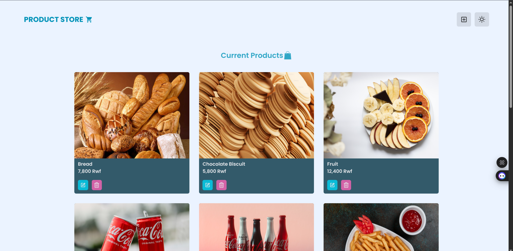
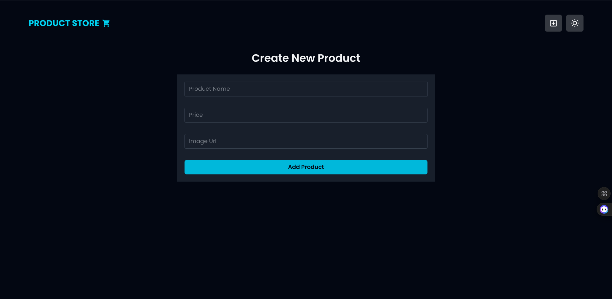

# 🛒 Product Store (MERN Stack)

A simple **Product Store** built with the **MERN stack** (MongoDB, Express, React, Node.js).  
This app allows users to **add, update, delete, and view products** with images, names, and prices.  
It also supports light/dark mode and smooth animations using **Framer Motion**.

## Features

- Add new products (with name, price, and image URL)
- Update existing products
- Delete products
- Display product list with images
- Light & Dark mode support
- Smooth UI animations using **Framer Motion**

---

## 🛠️ Tech Stack

- **Frontend**: React, Tailwind CSS, Framer Motion
- **Backend**: Node.js, Express.js
- **Database**: MongoDB
- **Other**: Axios for API calls

---

## 📷 Screenshots

### 🏠 Hero Page

#### Dark Mode

#### Light Mode

---

### Create New Product Page

#### Dark Mode

#### Light Mode

