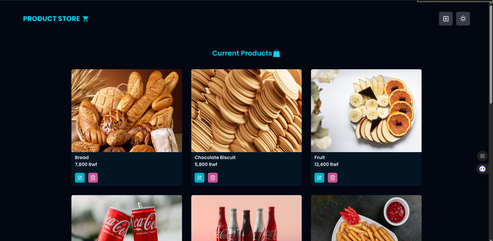
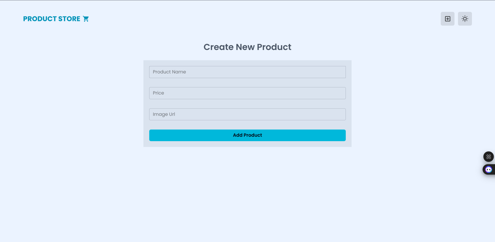

## 🚀 Features
- 📦 Add new products (with name, price, and image URL)
- 📝 Update existing products
- ❌ Delete products
- 🖼️ Display product list with images
- 🌗 Light & Dark mode support
- 🎬 Smooth UI animations using **Framer Motion**

---

## 🛠️ Tech Stack
- **Frontend**: React, Tailwind CSS, Framer Motion  
- **Backend**: Node.js, Express.js  
- **Database**: MongoDB  
- **Other**: Axios for API calls  

---

## 📷 Screenshots

### 🏠 Hero Page
#### Dark Mode

#### Light Mode

---

### ➕ Create New Product Page
#### Dark Mode

#### Light Mode

